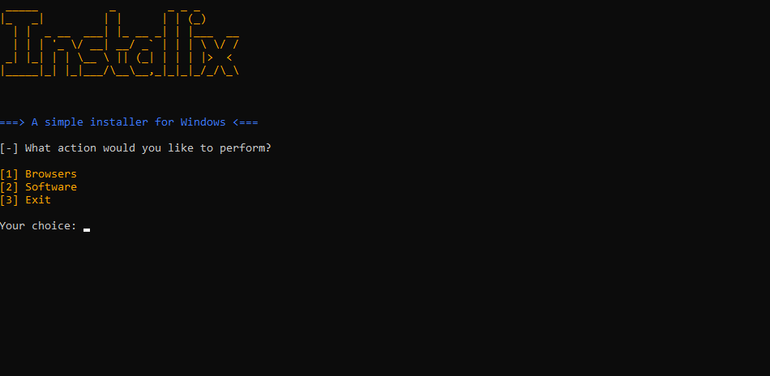
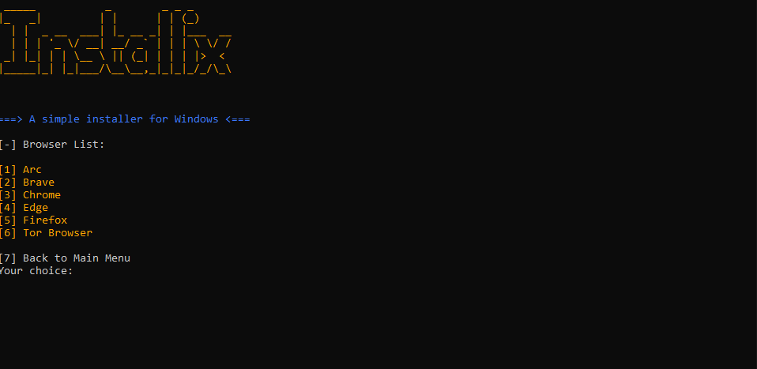
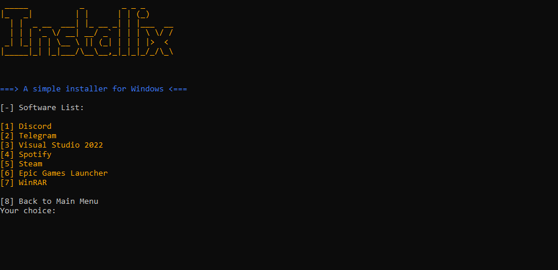

# Installix

# 📜 Description
Installix is a versatile tool designed to simplify the installation of software and browsers. Whether you’re setting up a new system or updating existing software, Installix streamlines the process, saving you time and effort. Its intuitive interface and comprehensive features ensure a smooth and efficient installation experience.

# ✨ Features
Easy Software Installation: Quickly install a wide range of software applications.
Browser Installation: Seamlessly install and configure popular web browsers.
User-Friendly Interface: A straightforward design that guides you through each step.
Time-Saving Automation: Automates repetitive installation tasks to streamline your setup process.
Customization Options: Tailor your installations with flexible settings and options.

# 📝 Usage
Open Installix:

* Launch the application.
  
* In the main interface, chooese Browser or Software & choose from the list of available software or browsers you wish to install.
Configure Installation:

* Once the installation is complete, review the results and check the installed applications or browsers.

# 🐛 Reporting Bugs
If you encounter any issues or bugs while using Installix, please report them on our [GitHub Issues page](https://github.com/ByteLogNet/Nexus-Tool/issues). We value your feedback and will work diligently to address any problems.

📄 License
Installix is licensed under the MIT License. See the [LICENSE](LICENSE) file for details.
